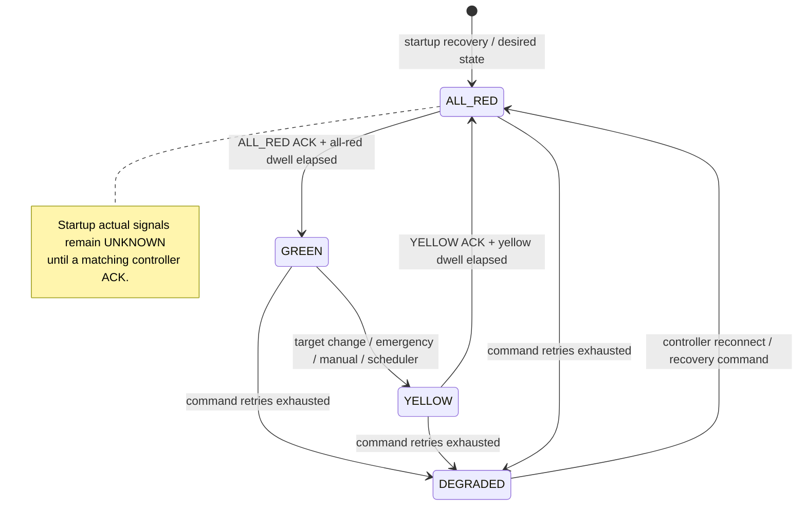

# Factory Traffic Management System

## 🌐 Live Deployments

- **Frontend Dashboard (Vercel)**: [https://factory-traffic-management-zeta.vercel.app](https://factory-traffic-management-zeta.vercel.app)
- **Backend API Server (Render)**: [https://factory-traffic-management-0qel.onrender.com](https://factory-traffic-management-0qel.onrender.com)
- **API Base URL**: `https://factory-traffic-management-0qel.onrender.com/api`
- **Health / Status Check**: `https://factory-traffic-management-0qel.onrender.com/`

---

## 1. Project Overview

A traffic-signal management system for factory junctions. The backend is Node.js, Express, TypeScript, PostgreSQL (`pg` with parameterized SQL), and Socket.IO. The frontend is React and Vite. A pure traffic decision engine handles phase selection; services serialize junction work, validate sensor events, persist changes, and communicate with a controller gateway.

## 2. Deliverables and Feature Coverage

- Pure `decide(state, input, now)` engine with safety assertions, weighted queues, starvation prevention, max-green timing, emergency precedence, and manual TTL.
- Automatic phase scoring uses default weights CAR 1, MOTORCYCLE 1.2, BUS 2, TRUCK 1.5, FORKLIFT 2.5, EMPLOYEE_VEHICLE 1.25, and EMERGENCY 10. Ordinary switches require a score advantage of at least 0.5 after minimum green and anti-flap dwell; starvation and max-green are overrides when the competing phase has traffic.
- Per-junction serialized service operations and PostgreSQL transactions using `SELECT ... FOR UPDATE`.
- PostgreSQL models for junctions/queues, sensor events, commands, controller events, and audit history.
- Sensor validation for invalid, duplicate, stale, and out-of-order events.
- Controller command IDs, ACK classification, retry handling, degraded all-red fallback, and reconnect support.
- REST API with Zod validation and centralized error handling.
- Startup recovery, periodic ticks, and Socket.IO state broadcasts.
- React operations dashboard, control panel, vehicle simulator, activity feed, and polling fallback.
- Vitest unit tests and Supertest API tests. A Postman collection is exported at [`backend/postman/factory-traffic-management.postman_collection.json`](backend/postman/factory-traffic-management.postman_collection.json).

## 3. Architecture

```text
frontend (React/Vite)
  | REST: /api/*                         Socket.IO: junction:update
  v
Express routes -> Zod -> controllers <- server.ts -> Socket.IO
                              |
         +--------------------+--------------------+
         v                    v                    v
  sensor.service       junction.service     command.service
  validate/replay      per-junction queue   ACK/retry/gateway
                              |
                     traffic.service
                 pure decide + assertSafe
                              |
                 PostgreSQL models (pg)
```

`traffic.service.ts` contains domain types and pure decision logic. It must not import Express, `pg`, or Socket.IO. SQL remains in `backend/src/models/`. Controllers translate HTTP requests and service results; they do not contain traffic-engine logic.

## 4. Safety State Model

`desired` is what the system has requested. `actual` is controller-confirmed state. They are intentionally distinct; on startup, actual signals are `UNKNOWN` until acknowledged. A command timeout prevents an unacknowledged transition from progressing and requests an all-red fallback.



Safety invariants:

- Conflicting phase groups (NORTH/SOUTH and EAST/WEST) are never GREEN together.
- A conflicting GREEN is never requested directly from GREEN; the path is GREEN → YELLOW → ALL_RED → GREEN.
- Manual and emergency requests use that same path. Emergency requests take precedence over manual mode and are served earliest-first.
- Repeated emergency sightings refresh only `lastSeenAt`; conflicting emergencies remain FIFO-queued, while same-phase emergencies can share service. Clearing an emergency removes it from priority; a still-live manual override resumes, otherwise the junction returns to automatic mode. Emergency priority expires after the configured stale interval without a refresh.
- Duplicate vehicle arrivals, unknown clears, duplicate commands, unknown ACKs, stale sensor events, and late ACKs are handled without silently advancing actual state.
- Tick processing is periodic; request handlers do not sleep.

## 5. Database Schema

The project uses the six existing tables; no schema changes are required by this implementation. Fresh installations use the ordered scripts `backend/sql/001_initial_schema.sql` and `backend/sql/002_seed_data.sql`:

| Table | Purpose |
| --- | --- |
| `junctions` | Junction identity, mode, current phase, controller status |
| `junction_queues` | Non-negative per-direction vehicle totals |
| `sensor_events` | Idempotent event ingestion, event sequence and timestamps |
| `traffic_commands` | Outbound command lifecycle and acknowledgement time |
| `controller_events` | Controller ACK/status history |
| `audit_logs` | State changes, sensor outcomes, and recovery records |

Database access uses bound parameters. Sensor idempotency uses `ON CONFLICT (event_id) DO NOTHING`; queue deltas use `GREATEST(queue_count + $delta, 0)`; junction updates lock rows with `SELECT ... FOR UPDATE`. Use `withTransaction` for grouped operations.

## 6. Setup and Run

Prerequisites: Node.js 24 or a compatible Node.js release, npm, and PostgreSQL. Create the `factory_traffic` database and apply the schema once to a fresh database:

```bash
createdb -h 127.0.0.1 -p 5432 -U postgres factory_traffic
psql -h 127.0.0.1 -p 5432 -U postgres -d factory_traffic -f backend/sql/001_initial_schema.sql
psql -h 127.0.0.1 -p 5432 -U postgres -d factory_traffic -f backend/sql/002_seed_data.sql
```

The seed script inserts Junction A and its four zero-count approaches. To run the isolated PostgreSQL verification against the configured DB server (it creates and drops a uniquely named temporary database):

```bash
npm --prefix backend exec -- tsx scripts/database-verification.ts
```

If PostgreSQL listens on another port, use that port in both commands and `DB_PORT`. Create `backend/.env` with the local connection values (do not commit credentials):

```dotenv
PORT=5000
DB_HOST=127.0.0.1
DB_PORT=5432
DB_NAME=factory_traffic
DB_USER=postgres
DB_PASSWORD=your-local-password
CONTROLLER_URL=http://127.0.0.1:6000
TICK_INTERVAL_MS=1000
```

Install and start in separate terminals:

```bash
npm install --prefix backend
npm install --prefix frontend
npm --prefix backend run dev
npm --prefix frontend run dev
```

Open the Vite URL printed by the frontend command (normally `http://localhost:5173`). The backend listens on `http://localhost:5000`. The frontend API base defaults to `http://localhost:5000/api`; override it with `VITE_API_URL` when needed. To run checks:

```bash
npm --prefix backend test
npm --prefix backend exec -- tsc --noEmit
npm --prefix frontend run build
```

## 7. Configuration and Runtime Behavior

- `DB_HOST`, `DB_PORT`, `DB_NAME`, `DB_USER`, `DB_PASSWORD`: PostgreSQL connection.
- `PORT`: Express/Socket.IO HTTP port (default `5000`).
- `CONTROLLER_URL`: REST controller simulator base URL (default `http://127.0.0.1:6000`). The simulator adapter posts commands to `/commands` and probes `/health`.
- `TICK_INTERVAL_MS`: decision tick interval (default `1000` milliseconds).
- `VITE_API_URL`: frontend API base (default `http://localhost:5000/api`).
- `FRONTEND_ORIGIN`: Socket.IO CORS origin (default `*` for local development).

At boot the server tests the DB connection, rebuilds active vehicle queues from accepted sensor history, sets actual signals to UNKNOWN, supersedes pending commands, resets mode to AUTOMATIC, persists an ALL_RED command and a `RECOVERY_RESET` audit row, then listens and starts ticking. Socket.IO emits `junction:update` and `controller:ack`. The dashboard polls REST every five seconds when the socket is disconnected and less frequently while connected.

## 8. REST API Reference

All endpoints are mounted at `/api` (Production: `https://factory-traffic-management-0qel.onrender.com/api`, Local: `http://localhost:5000/api`) and JSON requests use `Content-Type: application/json`.

### Endpoints Overview

| Method and Path | Description | Typical Responses |
| --- | --- | --- |
| `GET /` | Root health check & server status | `200 OK` |
| `GET /api/junctions` | List all monitored junctions | `200 OK` |
| `GET /api/junctions/:junctionId/status` | Current junction row, queue counts, desired & actual engine states | `200 OK`, `404 Not Found` |
| `POST /api/sensor-events` | Ingest vehicle detection & clearing sensor events (idempotent) | `201 Accepted`, `200 Duplicate`, `400 Invalid`, `404 Not Found`, `409 Stale/Out-of-order` |
| `POST /api/commands` | Dispatch phase commands (`TARGET_PHASE_REQUEST`, `MANUAL_MODE_REQUEST`, `EMERGENCY_REQUEST`, `RETURN_TO_AUTOMATIC`) | `201 Created`, `400 Bad Request`, `404 Not Found` |
| `POST /api/junctions/:junctionId/commands` | Submit directional manual control (`MANUAL_GREEN_REQUEST`, `RETURN_TO_AUTOMATIC`) | `201 Created`, `400 Bad Request`, `404 Not Found` |
| `GET /api/commands?junctionId=A&limit=100` | List commands log for a junction | `200 OK`, `400 Bad Request`, `404 Not Found` |
| `GET /api/commands/:commandId` | Retrieve a single command record by ID | `200 OK`, `404 Not Found` |
| `POST /api/controller-events` | Controller hardware acknowledgement & status ingestion | `201 Matched`, `200 Duplicate`, `400 Invalid`, `404 Not Found`, `409 Late ACK` |
| `GET /api/controller-events?junctionId=A&limit=100` | List controller ACK events for a junction | `200 OK`, `400 Bad Request`, `404 Not Found` |
| `GET /api/history?junctionId=A&limit=100` | List audit history events | `200 OK`, `400 Bad Request`, `404 Not Found` |

---

### Request Payload Schemas & Examples

#### 1. Sensor Event (`POST /api/sensor-events`)
```json
{
  "eventId": "sensor-evt-1001",
  "junctionId": "A",
  "direction": "NORTH",
  "eventType": "ARRIVED",
  "vehicleId": "truck-42",
  "vehicleType": "TRUCK",
  "sequenceNo": 1,
  "sensorTimestamp": "2026-10-08T15:30:00.000Z"
}
```
* Allowed `direction`: `NORTH`, `SOUTH`, `EAST`, `WEST`
* Allowed `eventType`: `ARRIVED`, `CLEARED`, `VEHICLE_ARRIVED`, `VEHICLE_CLEARED`
* Allowed `vehicleType`: `CAR`, `MOTORCYCLE`, `BUS`, `TRUCK`, `FORKLIFT`, `EMERGENCY`, `EMPLOYEE_VEHICLE`

#### 2. Phase / Emergency Command (`POST /api/commands`)
* **Target Phase**:
  ```json
  { "type": "TARGET_PHASE_REQUEST", "junctionId": "A", "phase": "EAST_WEST" }
  ```
* **Manual Override**:
  ```json
  { "type": "MANUAL_MODE_REQUEST", "junctionId": "A", "phase": "EAST_WEST" }
  ```
* **Emergency Priority**:
  ```json
  { "type": "EMERGENCY_REQUEST", "junctionId": "A", "emergencyId": "em-01", "phase": "NORTH_SOUTH", "occurredAt": 1728400000000 }
  ```
* **Return to Automatic**:
  ```json
  { "type": "RETURN_TO_AUTOMATIC", "junctionId": "A" }
  ```

#### 3. Directional Manual Command (`POST /api/junctions/:junctionId/commands`)
```json
{
  "command": "MANUAL_GREEN_REQUEST",
  "direction": "NORTH"
}
```

#### 4. Controller Acknowledgment (`POST /api/controller-events`)
```json
{
  "commandId": "cmd-uuid-or-null",
  "junctionId": "A",
  "status": "ACKNOWLEDGED",
  "actualState": "ALL_RED"
}
```
* Allowed `status`: `ACKNOWLEDGED`, `FAILED`, `TIMED_OUT`, `OFFLINE`, `ONLINE`

## 9. Curl Commands for the 9 Scenarios

These examples use Bash syntax, `curl`, and Node.js to make unique IDs and timestamps. Run them after setup. Responses can be inspected with `-i` to see status codes. Set the shared variables once:

```bash
export BASE_URL=http://localhost:5000/api
export JUNCTION_ID=A
export RUN_ID="$(node -p 'crypto.randomUUID()')"
```

### Scenario 1: List junctions

```bash
curl -i "$BASE_URL/junctions"
```

### Scenario 2: Read current junction status

```bash
curl -i "$BASE_URL/junctions/$JUNCTION_ID/status"
```

### Scenario 3: Ingest a vehicle arrival (expect 201)

```bash
export EVENT_ID="arrival-$RUN_ID"
curl -i -X POST "$BASE_URL/sensor-events" \
  -H 'Content-Type: application/json' \
  -d "{\"eventId\":\"$EVENT_ID\",\"junctionId\":\"$JUNCTION_ID\",\"direction\":\"NORTH\",\"eventType\":\"ARRIVED\",\"vehicleId\":\"vehicle-$RUN_ID\",\"vehicleType\":\"CAR\",\"sensorTimestamp\":\"$(node -p 'new Date().toISOString()')\"}"
```

### Scenario 4: Repeat the same event ID (expect 200 duplicate)

Run Scenario 3 first, then send the exact event again:

```bash
curl -i -X POST "$BASE_URL/sensor-events" \
  -H 'Content-Type: application/json' \
  -d "{\"eventId\":\"$EVENT_ID\",\"junctionId\":\"$JUNCTION_ID\",\"direction\":\"NORTH\",\"eventType\":\"ARRIVED\",\"vehicleId\":\"vehicle-$RUN_ID\",\"vehicleType\":\"CAR\",\"sensorTimestamp\":\"$(node -p 'new Date().toISOString()')\"}"
```

### Scenario 5: Submit an invalid direction (expect 400)

```bash
curl -i -X POST "$BASE_URL/sensor-events" \
  -H 'Content-Type: application/json' \
  -d "{\"eventId\":\"invalid-$RUN_ID\",\"junctionId\":\"$JUNCTION_ID\",\"direction\":\"UP\",\"eventType\":\"ARRIVED\",\"vehicleId\":\"bad-$RUN_ID\",\"vehicleType\":\"CAR\",\"sensorTimestamp\":\"$(node -p 'new Date().toISOString()')\"}"
```

### Scenario 6: Submit a stale event (expect 409)

```bash
export STALE_TS="$(node -p 'new Date(Date.now() - 120000).toISOString()')"
curl -i -X POST "$BASE_URL/sensor-events" \
  -H 'Content-Type: application/json' \
  -d "{\"eventId\":\"stale-$RUN_ID\",\"junctionId\":\"$JUNCTION_ID\",\"direction\":\"EAST\",\"eventType\":\"ARRIVED\",\"vehicleId\":\"stale-vehicle-$RUN_ID\",\"vehicleType\":\"TRUCK\",\"sequenceNo\":1,\"sensorTimestamp\":\"$STALE_TS\"}"
```

### Scenario 7: Request manual, then emergency priority

Both requests go through the normal safety sequence. `occurredAt` is Unix epoch milliseconds.

```bash
curl -i -X POST "$BASE_URL/commands" \
  -H 'Content-Type: application/json' \
  -d "{\"type\":\"MANUAL_MODE_REQUEST\",\"junctionId\":\"$JUNCTION_ID\",\"phase\":\"EAST_WEST\"}"

export NOW_MS="$(node -p 'Date.now()')"
curl -i -X POST "$BASE_URL/commands" \
  -H 'Content-Type: application/json' \
  -d "{\"type\":\"EMERGENCY_REQUEST\",\"junctionId\":\"$JUNCTION_ID\",\"emergencyId\":\"emergency-$RUN_ID\",\"phase\":\"NORTH_SOUTH\",\"occurredAt\":$NOW_MS}"
```

### Scenario 8: Read a command and submit a controller ACK

The first command is usually the recovery ALL_RED command on a fresh startup. For an ACK test, select a command that is still `PENDING`; substitute its `command_id` below.

```bash
curl -i "$BASE_URL/commands?junctionId=$JUNCTION_ID&limit=20"
export COMMAND_ID='paste-a-pending-command-id-here'
curl -i -X POST "$BASE_URL/controller-events" \
  -H 'Content-Type: application/json' \
  -d "{\"commandId\":\"$COMMAND_ID\",\"junctionId\":\"$JUNCTION_ID\",\"status\":\"ACKNOWLEDGED\",\"actualState\":\"ALL_RED\"}"
curl -i "$BASE_URL/controller-events?junctionId=$JUNCTION_ID&limit=20"
```

### Scenario 9: Return to automatic and inspect history

```bash
curl -i -X POST "$BASE_URL/commands" \
  -H 'Content-Type: application/json' \
  -d "{\"type\":\"RETURN_TO_AUTOMATIC\",\"junctionId\":\"$JUNCTION_ID\"}"
curl -i "$BASE_URL/history?junctionId=$JUNCTION_ID&limit=30"
```

## 10. Testing and Operational Verification

```bash
npm --prefix backend test
npm --prefix backend exec -- tsc --noEmit
npm --prefix frontend run build
```

Tests include deterministic phase-transition and mode rules, a randomized conflicting-GREEN invariant test, vehicle queue duplicate/clear/scoring/starvation tests, mocked controller gateway ACK/retry/degraded/reconnect cases, a `Promise.all` five-sensor-event serialization test, and Supertest API status/validation tests. A local DB model smoke check has also exercised the SQL model methods inside a transaction that was rolled back.

For a startup recovery check, leave a command pending and set a junction to MANUAL or EMERGENCY, restart the backend, then inspect:

```bash
curl "$BASE_URL/history?junctionId=$JUNCTION_ID&limit=10"
curl "$BASE_URL/commands?junctionId=$JUNCTION_ID&limit=10"
curl "$BASE_URL/junctions/$JUNCTION_ID/status"
```

The expected audit event is `RECOVERY_RESET`; old pending commands should be `SUPERSEDED`, and the new desired state should be ALL_RED while actual signals remain UNKNOWN until the controller acknowledges.

## 11. Assumptions / Questions / Requirement Issues

- No separate assessment PDF/spec or 12-heading checklist was present in the workspace. This README uses 12 numbered top-level sections based on the implemented system and the requested deliverables.
- The required six-table schema was kept unchanged. It has no columns for per-direction vehicle identity/arrival records, desired signals, actual signals, emergency FIFO entries, manual override expiry, retry counters, or a durable command payload. Vehicle identities are reconstructed from `sensor_events`; engine desired/actual state and mode overrides are in memory and are reset during process recovery. Durable recovery is conservative: supersede pending commands, request ALL_RED, and treat actual signals as UNKNOWN.
- The controller REST simulator does not automatically ACK. A real controller or simulator must implement the configured `/commands` and `/health` endpoints and POST ACKs to `/api/controller-events`.
- REST status codes: duplicate sensor event 200; accepted sensor/command/ACK request 201; invalid input 400; missing junction/command 404; stale/out-of-order sensor event or late ACK 409.
- No authentication/authorization policy or production CORS allow-list was supplied. The default Socket.IO CORS origin is permissive for local development and must be restricted before deployment.
- The nine curl scenarios above are a practical coverage set for the described capabilities, not a claim that they reproduce an unavailable external spec verbatim.

## 12. AI / Tool Usage

GitHub Copilot assisted with implementation and this documentation. The following tools were used in the repository workflow:

- `read_file`: inspected the existing root/frontend README, REST route schemas, traffic state types, server startup, package scripts, controller, and database model contracts before documenting real behavior.
- `file_search` and `grep_search`: checked for README/spec files and searched the workspace for scenario/spec/API references. No standalone nine-scenario specification was found.
- `apply_patch`: made code/documentation edits while preserving existing project files and the current backend package state.
- `run_in_terminal`: ran backend tests, TypeScript checks, frontend production builds, PostgreSQL readiness checks, and local recovery verification commands.
- `open_browser_page`, `read_page`, and `click_element`: inspected the running dashboard and exercised phase selection, manual control, and emergency control in the browser.
- `run_playwright_code` and `screenshot_page`: verified the simulation form, recent activity, degraded alert, blocked-Socket.IO polling fallback, live reconnection, and mobile/desktop layout.
- `get_errors`: checked the edited service/frontend files for editor diagnostics after implementation.

No external web research or generated source assets were used for this README. Commands and endpoint behavior were documented from the repository implementation; the unavailable spec was called out explicitly rather than inferred as fact.
